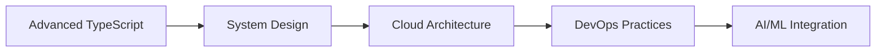

# Hi there, I'm Shie1 👋

 

---

## 🚀 About Me

I'm a passionate **Hungarian computer science student** with a love for creating innovative solutions and learning cutting-edge technologies. I believe in the power of open source and enjoy building tools that make people's lives easier.

- 🎓 **Computer Science Student** in Hungary
- 💡 **Open Source Enthusiast** - Contributing to the community
- 🔧 **Problem Solver** - Love tackling complex challenges
- 🌐 **Full-Stack Developer** - From frontend to backend
- 📱 **Tech Innovator** - Always exploring new technologies

---

## 🛠️ Technologies & Tools

### Languages

### Frontend

### Backend

### Tools & Platforms

---

## 🔥 Current Projects

### 🌟 Featured Projects

<table align="center">
<tr>
<td width="50%">
<h4>🎯 SwiftCard</h4>

A stylish digital business card platform revolutionizing networking

<strong>🔗 <a href="https://swiftcard.hu">Visit SwiftCard</a></strong>

</td>
<td width="50%">
<h4>⚡ Shibi-YTDL</h4>

The internet's fastest YouTube downloader with a clean interface

<strong>🔗 <a href="https://github.com/shie1/shibi-ytdl">View Repository</a></strong>

</td>
</tr>
<tr>
<td width="50%">
<h4>🎵 Ossia</h4>

Free, open source alternative to YouTube Music with modern features

<strong>🔗 <a href="https://github.com/shie1/ossia">View Repository</a></strong>

</td>
<td width="50%">
<h4>🚌 Menetrendek.info</h4>

Hungarian timetable search engine for public transportation

<strong>🔗 <a href="https://github.com/menetrendek-info/webmenetrend">View Repository</a></strong>

</td>
</tr>
</table>

### 🔧 Other Notable Projects
- **🪟 Windows Activation Tool** - Simple script for Windows activation
- **🎧 Splatter** - Spotify bot made in Python with advanced features

---

## 📈 GitHub Statistics

---

## 🌱 Currently Learning

- 🔹 **Advanced TypeScript** - Exploring complex type systems
- 🔹 **System Design** - Learning scalable architecture patterns  
- 🔹 **Cloud Technologies** - AWS, Docker, Kubernetes
- 🔹 **DevOps** - CI/CD, automation, and deployment strategies
- 🔹 **AI/ML Integration** - Incorporating AI into web applications

---

## 📬 Let's Connect!

---

## ⚡ Fun Facts & Interests

- 🎮 **Gaming Enthusiast** - Love exploring virtual worlds
- 🍕 **Pizza Connoisseur** - Always hunting for the perfect slice
- 🌍 **Travel Dreamer** - Planning to code from around the globe
- 🎵 **Music Lover** - Coding to the rhythm of various genres
- 📚 **Continuous Learner** - There's always something new to discover!

---

### 💭 *"Code is like humor. When you have to explain it, it's bad."* - Cory House

**Thanks for visiting my profile! Feel free to explore my repositories and don't forget to ⭐ any project you find interesting!**

